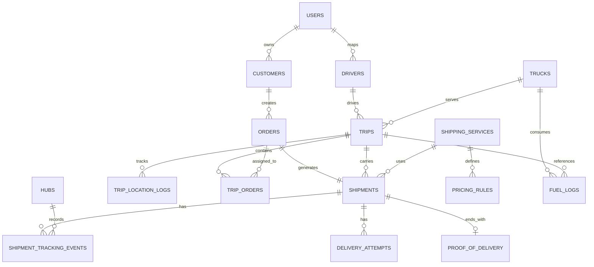

# ERD Mô Hình Giao Nhận Tương Tự GHN

Tài liệu này mô tả mô hình dữ liệu đề xuất nếu mở rộng hệ thống TMS hiện tại sang hướng giao nhận tương tự GHN, tức là tập trung vào:

- khách hàng tạo đơn
- hệ thống sinh vận đơn
- theo dõi timeline giao nhận
- quản lý nhiều chặng vận chuyển
- tính giá cước theo dịch vụ và quy tắc

## 1. Mục tiêu mô hình

So với mô hình vận tải xe tải đường dài hiện tại, mô hình GHN-like cần thêm các lớp:

- `shipment`: vận đơn thực thi thực tế
- `shipment_tracking_events`: lịch sử trạng thái giao nhận
- `shipping_services`: dịch vụ giao hàng
- `pricing_rules`: quy tắc tính giá cước
- `proof_of_delivery`: bằng chứng giao hàng
- `delivery_attempts`: số lần giao
- `hubs / depots`: điểm trung chuyển

Mục tiêu là tách rõ:

- `order`: yêu cầu nghiệp vụ từ khách hàng
- `shipment`: luồng giao nhận thực tế để vận hành và tracking

## 2. Thực thể chính

### 2.1. Users

Lưu tài khoản đăng nhập hệ thống.

Thuộc tính chính:

- `id`
- `role_id`
- `username`
- `password_hash`
- `full_name`

Quan hệ:

- 1 user có thể là `admin`, `dispatcher`, `driver`, `customer`

### 2.2. Customers

Lưu thông tin khách hàng gửi hàng.

Thuộc tính chính:

- `id`
- `user_id`
- `name`
- `phone`
- `email`
- `address`

Quan hệ:

- 1 customer có nhiều `orders`

### 2.3. Orders

Lưu yêu cầu tạo đơn từ khách hàng.

Thuộc tính chính:

- `id`
- `customer_id`
- `order_code`
- `pickup_location`
- `delivery_location`
- `cargo_type`
- `weight_tons`
- `planned_revenue`
- `status`
- `created_at`

Quan hệ:

- 1 order có thể sinh 1 shipment chính
- 1 order có thể được gắn vào 1 chuyến xe liên tỉnh hoặc nhiều chặng nội bộ tùy mô hình

### 2.4. Shipments

Đây là bảng mới quan trọng nhất nếu mô hình hóa như GHN.

Ý nghĩa:

- đại diện cho vận đơn thực tế được mang đi giao
- phục vụ tracking, ETA, COD, giao lại, hoàn hàng

Thuộc tính đề xuất:

- `id`
- `order_id`
- `shipment_code`
- `service_id`
- `current_status`
- `current_hub_id`
- `assigned_driver_id`
- `assigned_trip_id`
- `recipient_name`
- `recipient_phone`
- `recipient_address`
- `cod_amount`
- `shipping_fee`
- `estimated_delivery_at`
- `actual_delivery_at`
- `created_at`
- `updated_at`

Quan hệ:

- 1 shipment thuộc về 1 order
- 1 shipment có nhiều `shipment_tracking_events`
- 1 shipment có nhiều `delivery_attempts`
- 1 shipment có thể có 1 `proof_of_delivery`

### 2.5. Shipment Tracking Events

Lưu timeline giao nhận giống GHN.

Thuộc tính đề xuất:

- `id`
- `shipment_id`
- `status_code`
- `status_label`
- `description`
- `event_time`
- `hub_id`
- `latitude`
- `longitude`
- `created_by_user_id`

Ví dụ trạng thái:

- `CREATED`
- `PICKUP_PENDING`
- `PICKED_UP`
- `AT_ORIGIN_HUB`
- `IN_TRANSIT`
- `AT_DESTINATION_HUB`
- `OUT_FOR_DELIVERY`
- `DELIVERED`
- `DELIVERY_FAILED`
- `RETURNING`
- `RETURNED`

Quan hệ:

- 1 shipment có nhiều tracking event

### 2.6. Delivery Attempts

Lưu lịch sử thử giao.

Thuộc tính đề xuất:

- `id`
- `shipment_id`
- `attempt_no`
- `driver_id`
- `attempt_time`
- `result`
- `failure_reason`
- `next_retry_time`

Quan hệ:

- 1 shipment có nhiều delivery attempt

### 2.7. Proof Of Delivery

Lưu bằng chứng giao hàng điện tử.

Thuộc tính đề xuất:

- `id`
- `shipment_id`
- `receiver_name`
- `receiver_phone`
- `delivered_at`
- `photo_url`
- `signature_url`
- `note`

Quan hệ:

- 1 shipment có tối đa 1 proof_of_delivery chính

### 2.8. Drivers

Lưu thông tin tài xế hoặc nhân viên giao nhận.

Thuộc tính chính:

- `id`
- `user_id`
- `full_name`
- `phone`
- `license_number`
- `license_class`
- `status`

Quan hệ:

- 1 driver có thể phụ trách nhiều `trips`
- 1 driver có thể giao nhiều `shipments`

### 2.9. Trucks

Lưu phương tiện vận chuyển.

Thuộc tính chính:

- `id`
- `license_plate`
- `truck_type`
- `capacity_tons`
- `status`
- `cumulative_km`
- `maintenance_interval_km`
- `last_maintenance_km`

Quan hệ:

- 1 truck có nhiều `trips`
- 1 truck có nhiều `fuel_logs`

### 2.10. Trips

Giữ nguyên ý tưởng hiện tại cho chuyến xe đường dài hoặc chặng gom/trung chuyển.

Thuộc tính chính:

- `id`
- `trip_code`
- `truck_id`
- `driver_id`
- `start_date`
- `end_date`
- `origin`
- `destination`
- `status`

Quan hệ:

- 1 trip có nhiều `orders` qua `trip_orders`
- 1 trip có thể gắn nhiều `shipments`
- 1 trip có nhiều `trip_location_logs`

### 2.11. Trip Orders

Bảng trung gian đang có trong hệ thống.

Ý nghĩa:

- gắn đơn hàng vào chuyến

Thuộc tính chính:

- `trip_id`
- `order_id`

### 2.12. Trip Location Logs

Lưu GPS theo chuyến.

Thuộc tính chính:

- `id`
- `trip_id`
- `latitude`
- `longitude`
- `speed_kmh`
- `recorded_at`
- `source`

Quan hệ:

- 1 trip có nhiều vị trí GPS

### 2.13. Hubs / Depots

Nếu mô hình giống GHN hơn, nên phân biệt:

- `depot`: kho/tổng kho
- `hub`: điểm trung chuyển

Thuộc tính đề xuất:

- `id`
- `code`
- `name`
- `type`
- `address`
- `latitude`
- `longitude`
- `province`
- `district`

Quan hệ:

- 1 hub có thể xuất hiện trong nhiều tracking event
- 1 shipment có thể đi qua nhiều hub

### 2.14. Shipping Services

Lưu các loại dịch vụ giao hàng.

Thuộc tính đề xuất:

- `id`
- `service_code`
- `service_name`
- `max_weight`
- `sla_hours`
- `description`

Ví dụ:

- `STANDARD`
- `EXPRESS`
- `HEAVY_CARGO`

Quan hệ:

- 1 service có nhiều shipments
- 1 service có nhiều pricing rules

### 2.15. Pricing Rules

Lưu quy tắc tính giá cước.

Thuộc tính đề xuất:

- `id`
- `service_id`
- `vehicle_type`
- `region_from`
- `region_to`
- `distance_from_km`
- `distance_to_km`
- `weight_from`
- `weight_to`
- `base_fee`
- `per_km_fee`
- `per_kg_fee`
- `cod_fee`
- `oversize_fee`
- `active`

Quan hệ:

- nhiều rule thuộc 1 service

### 2.16. Fuel Logs

Đã có trong hệ thống.

Dùng cho:

- dự báo nhiên liệu
- phân tích tiêu hao
- cảnh báo bất thường

## 3. Quan hệ tổng quát

## 4. So sánh với mô hình hiện tại

### Đã có sẵn trong project

- `users`
- `customers`
- `drivers`
- `trucks`
- `orders`
- `trips`
- `trip_orders`
- `trip_location_logs`
- `fuel_logs`
- `depots`

### Nên bổ sung để giống GHN hơn

- `shipments`
- `shipment_tracking_events`
- `delivery_attempts`
- `proof_of_delivery`
- `hubs`
- `shipping_services`
- `pricing_rules`

## 5. Phạm vi triển khai phù hợp cho đồ án

Không cần làm toàn bộ như GHN production. Nên chọn bản rút gọn:

### Giai đoạn 1

- khách hàng tạo đơn
- hệ thống tính giá cước
- điều phối gán đơn vào chuyến
- tài xế cập nhật trạng thái

### Giai đoạn 2

- thêm `shipment_tracking_events`
- thêm timeline giao nhận
- khách hàng xem ETA và vị trí giao hàng

### Giai đoạn 3

- thêm `proof_of_delivery`
- thêm `pricing_rules`
- thêm dịch vụ giao hàng

## 6. Kết luận

Nếu muốn hệ thống nhìn giống GHN hơn, trọng tâm không nằm ở việc thêm thật nhiều CRUD, mà ở việc:

- tách `order` và `shipment`
- có timeline tracking rõ ràng
- có logic giá cước theo dịch vụ
- có bằng chứng giao hàng
- có nhiều trạng thái giao nhận thay vì chỉ trạng thái vận tải

Đây là hướng mở rộng phù hợp nhất để nâng đề tài từ “quản lý vận tải xe tải” sang “hệ thống quản lý giao nhận thông minh”.
